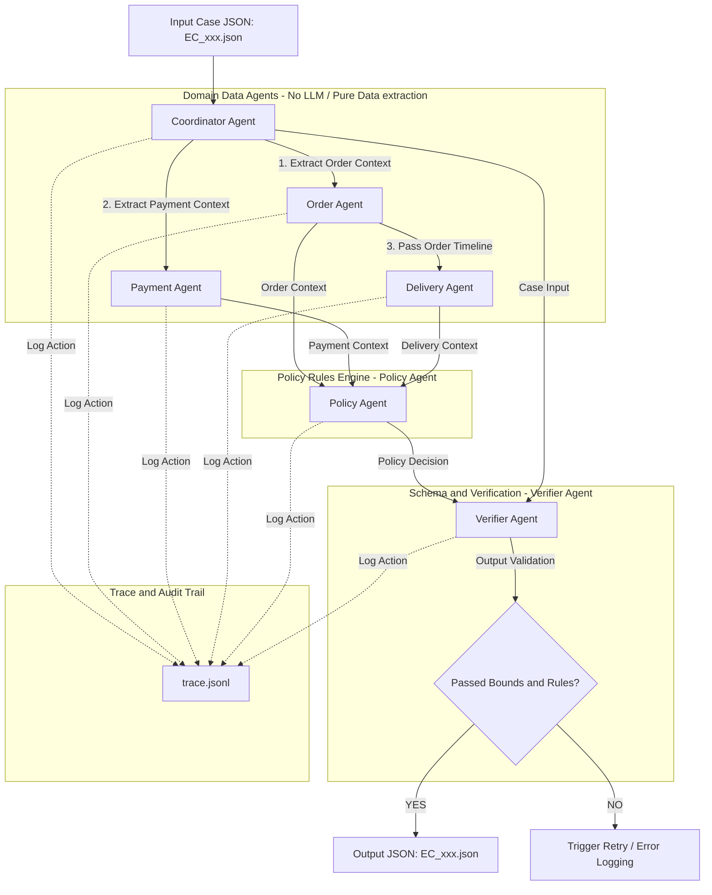
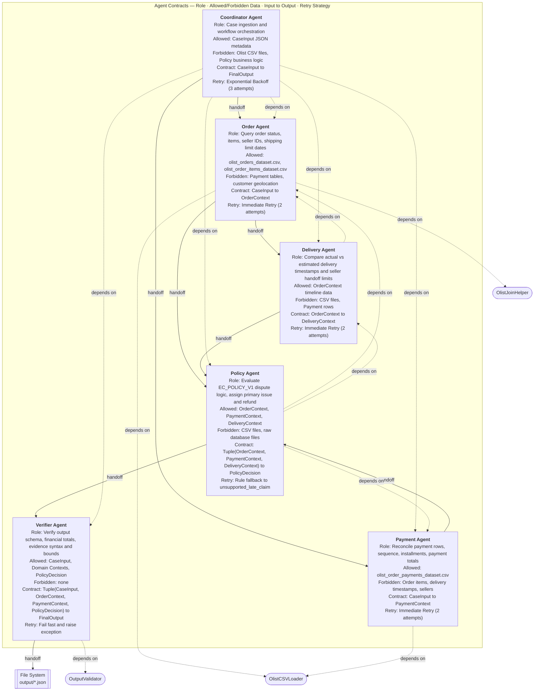
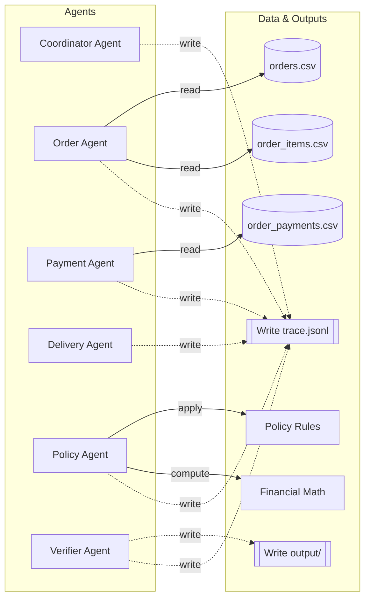
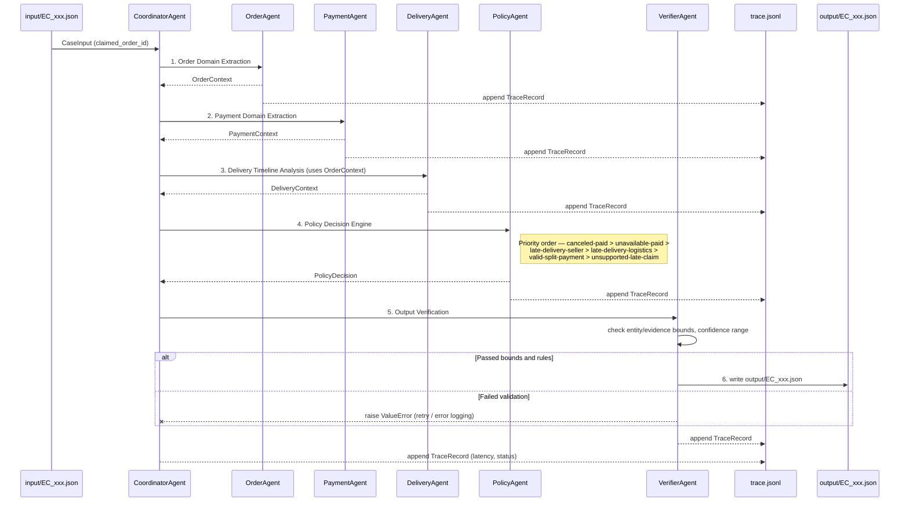

# Multi-Agent E-Commerce Dispute Resolution System Architecture

> All sections below are expressed as Mermaid diagrams instead of plain tables/lists, so the whole spec renders visually in any Mermaid-aware viewer (GitHub, GitLab, mermaid.live, etc.).

## 1. System Architecture Diagram

---

## 2. Multi-Agent Design Table

*Solid arrows = handoff target (who receives this agent's output next). Dashed arrows = dependency (what this agent needs before it can run — either an upstream agent's context or a helper module).*

---

## 3. Data Access & Boundary Matrix

*Only permitted (✅) accesses from the original boundary matrix are drawn — the absence of an edge between an agent and a resource means that access is forbidden (❌). `DeliveryAgent` has no edge into `Resources` besides trace logging: it computes purely over `OrderContext` passed in-memory from `OrderAgent`, never touching a CSV file directly.*

---

## 4. End-to-End Workflow Steps

*Step 7 (Trace Logging) from the original list is not a separate final step — every agent (including the Coordinator itself) appends its own `TraceRecord` to `trace.jsonl` immediately after it runs, whether it succeeds or fails.*
